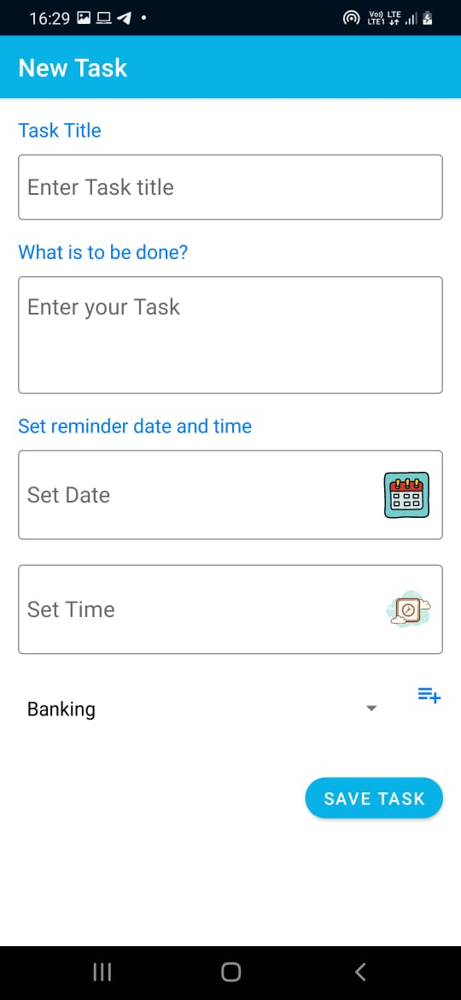
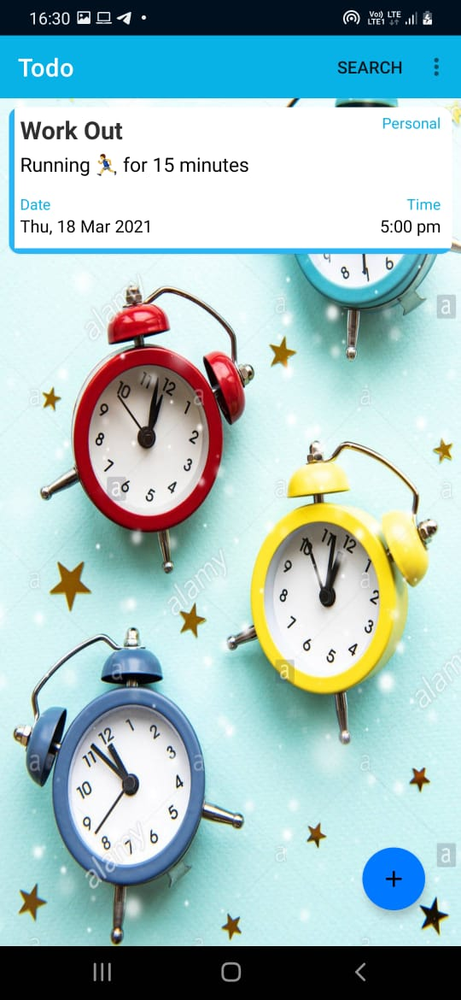

# GetItDone

## Simple minimalist Todo app

The app is used to create todos and uses Room database on backend.

Installing the app can be done through downloading the cloned repository code

<b>Enjoy exploring the app.</b>
